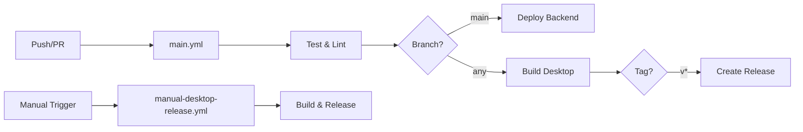

# GitHub Actions Workflow Guide

## Overview

This repository uses GitHub Actions for continuous integration and deployment. We maintain a streamlined workflow structure to avoid redundant runs and optimize resource usage.

## Active Workflows

### 1. `main.yml` - Primary CI/CD Pipeline
- **Purpose**: Main workflow for testing, building, and deploying
- **Triggers**:
  - Push to `main` branch
  - Pull requests to `main` branch  
  - Version tags (`v*`)
  - Manual workflow dispatch
- **Jobs**:
  - **test**: Runs linting, type checking, and tests
  - **deploy-backend**: Deploys backend to Railway (main branch only)
  - **build-desktop**: Builds desktop apps for all platforms
  - **release**: Creates GitHub releases (version tags only)

### 2. `manual-desktop-release.yml` - Manual Desktop Release
- **Purpose**: Manual desktop app release workflow
- **Triggers**:
  - Semantic version tags (`v*.*.*`)
  - Manual workflow dispatch with version input
- **Use Case**: Creating desktop releases outside the main CI/CD pipeline

## Workflow Architecture

## Best Practices

### 1. **Avoid Duplicate Triggers**
- Never have multiple workflows with the same `on:` triggers
- Use conditional logic within a single workflow instead

### 2. **Memory Management**
- Set `NODE_OPTIONS: --max-old-space-size=8192` for memory-intensive tasks
- Use swap space for additional memory when needed
- Free disk space before large operations

### 3. **Caching Strategy**
- Cache npm dependencies with proper cache keys
- Include Node.js version in cache keys
- Use `restore-keys` for fallback caching

### 4. **Conditional Execution**
- Use `if:` conditions to control job execution
- Deploy only from main branch
- Create releases only for version tags

## Troubleshooting

### Multiple Workflow Runs
If you see multiple workflows triggered by a single push:
1. Check for duplicate triggers in different workflow files
2. Review the "Actions" tab to identify which workflows are running
3. Consolidate workflows with similar purposes

### Memory Issues
If workflows fail due to memory:
1. Increase `--max-old-space-size` value
2. Add swap space setup
3. Use the free-disk-space action
4. Split large jobs into smaller ones

### NPM Install Failures
Common solutions:
1. Clear npm cache: `npm cache clean --force`
2. Use `npm ci` instead of `npm install`
3. Set proper timeouts and retry limits
4. Use `--prefer-offline` flag

## Monitoring Workflows

### GitHub UI
1. Go to Actions tab in your repository
2. Filter by workflow name
3. Check run duration and success rate
4. Review logs for failed runs

### Workflow Timing
- Average test job: 5-10 minutes
- Backend deployment: 2-3 minutes
- Desktop builds: 10-15 minutes per platform
- Full pipeline: 20-30 minutes

## Cost Optimization

### Free Tier Limits
- Public repos: Unlimited Actions minutes
- Private repos: 2,000 minutes/month (free tier)

### Optimization Tips
1. Use job conditions to skip unnecessary work
2. Parallelize independent jobs
3. Cache dependencies aggressively
4. Use matrix builds efficiently
5. Fail fast on critical errors

## Adding New Workflows

Before adding a new workflow:
1. Check if functionality can be added to existing workflows
2. Ensure no trigger conflicts with existing workflows
3. Document the purpose and triggers
4. Test with `workflow_dispatch` first
5. Monitor initial runs for issues

## Archived Workflows

Old workflows are archived in `.github/workflows-archive/` for reference. These were consolidated to prevent:
- Duplicate runs
- Resource waste
- Maintenance overhead
- Confusion about authoritative workflows

## Security Considerations

1. **Secrets Management**:
   - Use GitHub Secrets for sensitive data
   - Never log secret values
   - Rotate secrets regularly

2. **Permissions**:
   - Use minimal required permissions
   - Specify permissions explicitly
   - Review third-party actions

3. **Dependencies**:
   - Pin action versions
   - Review action source code
   - Prefer official actions

## Support

For workflow issues:
1. Check workflow logs in GitHub Actions
2. Review this guide for best practices
3. Check archived workflows for historical context
4. Open an issue with workflow logs attached