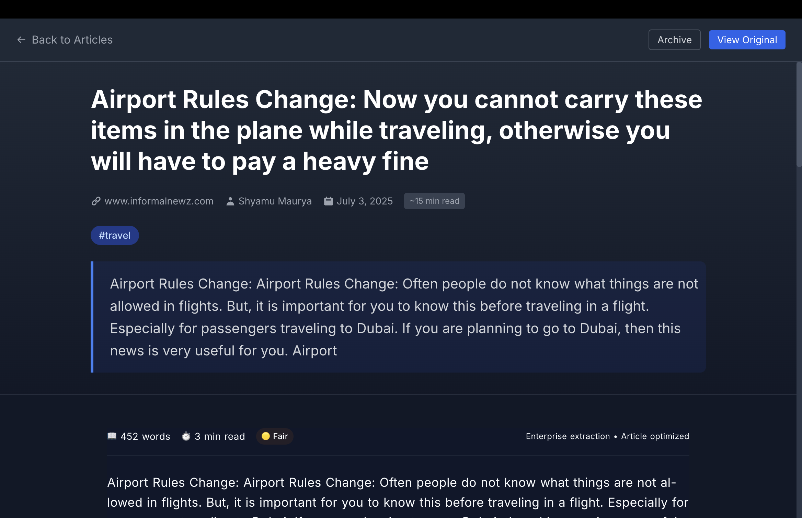
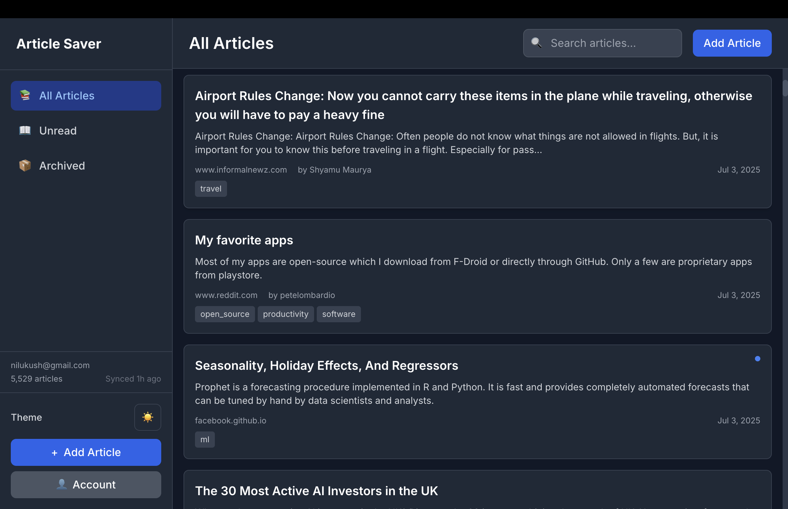
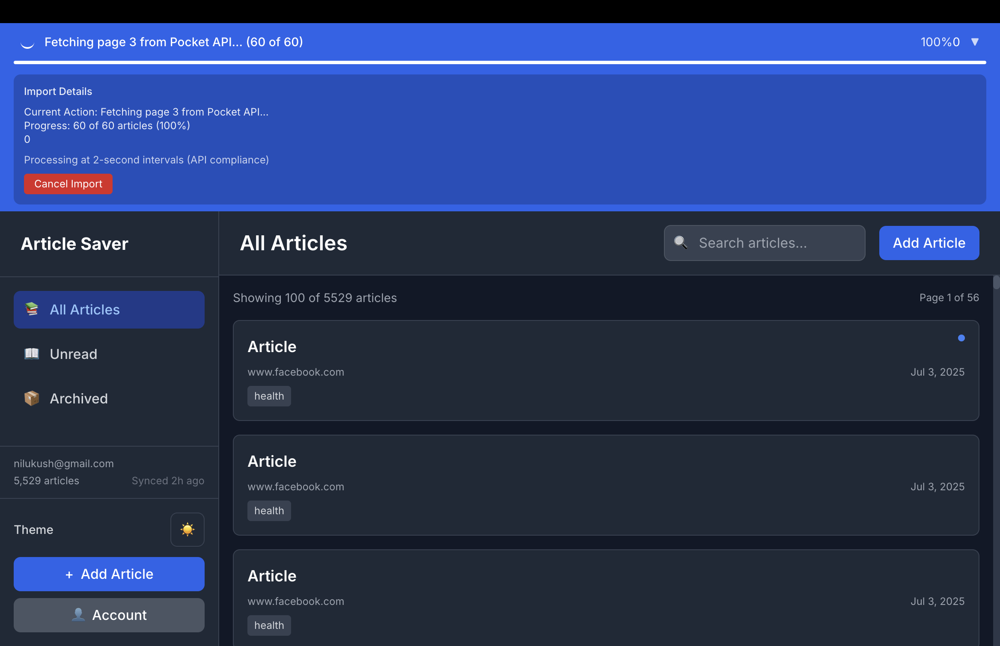
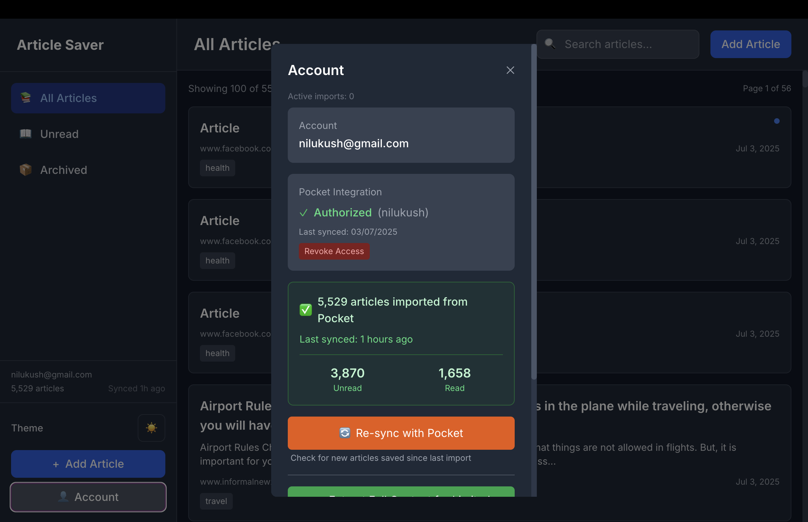
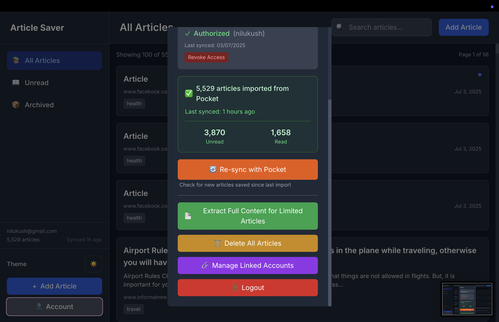
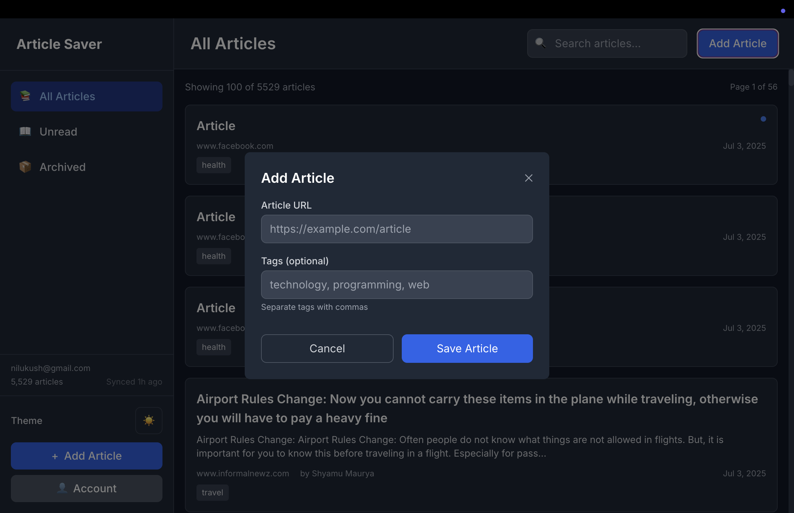

# Fix All Current Issues - Complete Guide

## Issue 1: Vercel Deployment Not Showing ⏳

### Why This Happens:
- UI delays in Vercel dashboard
- Browser cache issues
- Deployment might be queued

### Fix:
1. **Hard refresh the page**: Cmd+Shift+R (Mac) or Ctrl+F5 (Windows)
2. **Check different ways**:
   - Go to: https://vercel.com/dashboard
   - Click on your Umami project
   - Look for "Building" or "Ready" status
   - Check the "Deployments" tab

3. **Force new deployment**:
   ```bash
   # If nothing shows after 5 minutes, go to:
   Settings → Git → Deploy Hooks
   # Create a hook and trigger it
   ```

4. **Direct link**: Try accessing your deployment directly:
   - https://umami-green-gamma-76.vercel.app/

## Issue 2: Remove Personal Info from Screenshots 🔒

### Screenshots that show "nilukush@gmail.com" or "(nilukush)":
1. `account-and-sync.png` - Shows email and username
2. `pocket-options.png` - Shows username in Pocket integration

### Privacy Best Practices:
For a public website, you should:
1. **Replace with generic text** like "user@example.com" or "demo_user"
2. **Blur the personal information**
3. **Use a demo account** for screenshots

### Quick Fix Options:

#### Option A: Blur in Preview (Mac)
1. Open screenshot in Preview
2. Select the email/username area
3. Tools → Annotate → Rectangle
4. Fill with solid color to hide text

#### Option B: Use Online Tool
1. Go to: https://redact.photo/ (free, no signup)
2. Upload screenshot
3. Click and drag to blur areas
4. Download edited version

#### Option C: Professional Edit
Use Photopea (free online Photoshop):
1. Go to: https://www.photopea.com/
2. Open screenshot
3. Use Clone Stamp or Text tool to replace
4. Change "nilukush@gmail.com" to "user@example.com"
5. Change "(nilukush)" to "(demo_user)"

## Issue 3: Add New Article View Screenshot 📸

### Update HTML to include the new screenshot:

1. **Add to screenshot tabs**:
```html
<button class="tab-button" onclick="showScreenshot('view', event)">Article View</button>
```

2. **Add image element**:
```html

```

3. **Add description**:
```html
<p id="desc-view" class="desc">Distraction-free reading experience with customizable options and article metadata</p>
```

## Complete HTML Update

Here's the full screenshot section update:

```html
<div class="screenshot-tabs">
    <button class="tab-button active" onclick="showScreenshot('list', event)">Article List</button>
    <button class="tab-button" onclick="showScreenshot('view', event)">Article View</button>
    <button class="tab-button" onclick="showScreenshot('import', event)">Import Progress</button>
    <button class="tab-button" onclick="showScreenshot('account', event)">Account & Sync</button>
    <button class="tab-button" onclick="showScreenshot('pocket', event)">Pocket Options</button>
    <button class="tab-button" onclick="showScreenshot('add', event)">Add Articles</button>
</div>

<div class="screenshot-container">
    
    
    
    
    
    
</div>

<div class="screenshot-description">
    <p id="desc-list" class="desc active">Clean, organized interface showing all your saved articles with tags, search, and filtering options</p>
    <p id="desc-view" class="desc">Distraction-free reading experience with customizable options and article metadata</p>
    <p id="desc-import" class="desc">Real-time import progress with detailed status updates and API compliance indicators</p>
    <p id="desc-account" class="desc">Manage your account and Pocket integration with real-time sync status and statistics</p>
    <p id="desc-pocket" class="desc">Successfully imported 5,529 articles from Pocket with detailed import statistics</p>
    <p id="desc-add" class="desc">Easily add new articles with custom tags for better organization and searchability</p>
</div>
```

## Action Steps:

1. **Fix Screenshots** (5 minutes):
   - Edit `account-and-sync.png` to hide email
   - Edit `pocket-options.png` to hide username
   - Save edited versions with same names

2. **Update HTML** (2 minutes):
   - Add article view to tabs
   - Update screenshot elements
   - Push changes

3. **Check Vercel** (1 minute):
   - Should show deployment by now
   - If not, check Function logs

## Privacy Recommendation:

For production websites, always use:
- Generic emails: `user@example.com`
- Generic usernames: `demo_user` or `example_user`
- Blurred or replaced personal data
- Test accounts for screenshots

This protects your privacy and looks more professional!