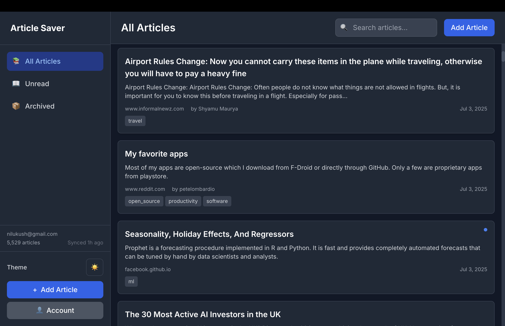

# Screenshot Implementation Plan

## Current Status
- You have 4 excellent screenshots taken of the Article Saver app
- Screenshots show: article list, account panel, Pocket integration, and add article dialog
- Files are in your Dropbox folder

## Immediate Actions

### Option 1: Manual Copy (Recommended)
1. Open Finder
2. Navigate to: `/Users/nileshkumar/Dropbox/Screenshots/`
3. Create folder: `article_saver/screenshots/`
4. Copy these files:
   - `Screenshot 2025-07-03 at 7.53.37 PM.png` → `screenshots/article-list.png`
   - `Screenshot 2025-07-03 at 7.53.56 PM.png` → `screenshots/account-panel.png`
   - `Screenshot 2025-07-03 at 7.54.01 PM.png` → `screenshots/pocket-integration.png`
   - `Screenshot 2025-07-03 at 7.54.08 PM.png` → `screenshots/add-article.png`

### Option 2: Use Placeholder for Now
The current SVG placeholder in index.html is fine for initial launch. You can update later.

### Option 3: Create Enhanced Screenshot Section
Once you have the screenshots in place, update index.html:

```html
<!-- Replace the current screenshot section with this -->
<section class="screenshots">
    <div class="container">
        <h2 class="section-title">See Article Saver In Action</h2>
        
        <div class="screenshot-tabs">
            <button class="tab-button active" onclick="showScreenshot('list')">Article List</button>
            <button class="tab-button" onclick="showScreenshot('account')">Account & Sync</button>
            <button class="tab-button" onclick="showScreenshot('pocket')">Pocket Import</button>
            <button class="tab-button" onclick="showScreenshot('add')">Add Articles</button>
        </div>
        
        <div class="screenshot-container">
            
            
            
            
        </div>
        
        <div class="screenshot-description">
            <p id="desc-list" class="desc active">Clean, organized interface showing all your saved articles with tags and metadata</p>
            <p id="desc-account" class="desc">Manage your account and Pocket integration with real-time sync status</p>
            <p id="desc-pocket" class="desc">Successfully imported 5,529 articles from Pocket with reading stats</p>
            <p id="desc-add" class="desc">Easily add new articles with custom tags for better organization</p>
        </div>
    </div>
</section>

<style>
.screenshot-tabs {
    display: flex;
    justify-content: center;
    gap: 10px;
    margin-bottom: 30px;
    flex-wrap: wrap;
}

.tab-button {
    padding: 10px 20px;
    border: 2px solid var(--primary-color);
    background: white;
    color: var(--primary-color);
    cursor: pointer;
    border-radius: 5px;
    transition: all 0.3s;
}

.tab-button.active {
    background: var(--primary-color);
    color: white;
}

.screenshot-container {
    position: relative;
    max-width: 900px;
    margin: 0 auto;
    border-radius: 10px;
    overflow: hidden;
    box-shadow: 0 20px 40px rgba(0,0,0,0.1);
}

.screenshot {
    width: 100%;
    height: auto;
    display: none;
}

.screenshot.active {
    display: block;
}

.screenshot-description {
    margin-top: 20px;
    text-align: center;
}

.desc {
    display: none;
    color: #666;
    font-size: 1.1rem;
}

.desc.active {
    display: block;
}
</style>

<script>
function showScreenshot(type) {
    // Hide all screenshots and descriptions
    document.querySelectorAll('.screenshot').forEach(img => img.classList.remove('active'));
    document.querySelectorAll('.desc').forEach(desc => desc.classList.remove('active'));
    document.querySelectorAll('.tab-button').forEach(btn => btn.classList.remove('active'));
    
    // Show selected screenshot and description
    document.getElementById('screenshot-' + type).classList.add('active');
    document.getElementById('desc-' + type).classList.add('active');
    
    // Update active button
    event.target.classList.add('active');
}
</script>
```

## For Social Media (og-image.png)
Create a 1200x630px image combining:
- Article Saver logo/name
- "Save Your Pocket Articles Before July 8, 2025"
- Screenshot preview
- Download button visual

## Next Steps
1. Manually copy screenshots to the repository
2. Update index.html with the enhanced screenshot section
3. Commit and push the changes
4. Test on live site